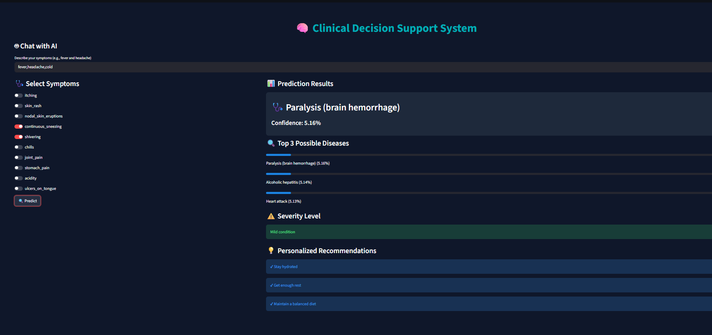

# 🧠 Intelligent Symptom-Based Disease Prediction & Clinical Support System


🚀 Developed during my **Data Science Internship at Global Quest Technologies (GQT)**
💡 A machine learning-powered system that predicts diseases based on symptoms and provides clinical decision support.

---

## 📸 Preview



---

## 🚀 Overview

This project is an interactive healthcare application that uses machine learning to predict possible diseases based on user-input symptoms.

It goes beyond basic prediction by offering:

* Confidence scores
* Multiple possible disease outcomes
* Severity analysis
* Personalized recommendations

👉 Designed to assist in **early-stage clinical decision support**.

---

## 🔍 Key Features

* 🤖 **Chatbot-style symptom input** (basic NLP)
* 📊 **Confidence score** for prediction reliability
* 🔍 **Top 3 possible diseases**
* ⚠️ **Severity analysis** (mild / moderate / high)
* 💡 **Personalized recommendations**
* 🎨 **Interactive and modern UI using Streamlit**

---

## 🧠 How It Works

1. User enters symptoms (via toggle or chatbot input)
2. Input is converted into structured data
3. Random Forest model processes the input
4. System outputs:

   * Predicted disease
   * Confidence score
   * Top 3 possible diseases
   * Severity level
   * Health recommendations

---

## 🧰 Tech Stack

* **Python**
* **Scikit-learn** (Random Forest Classifier)
* **Pandas** (Data Processing)
* **Streamlit** (UI & Deployment)

---

## ▶️ How to Run Locally

```bash
pip install streamlit pandas scikit-learn
streamlit run app.py
```

---

## 📌 Project Highlights

* Implemented **data cleaning and feature selection** for improved accuracy
* Used **dynamic filtering** to remove rare disease noise
* Built an **interactive UI with real-time prediction**
* Integrated **chatbot-style input for better user experience**

---

## 🚀 Future Improvements

* 🤖 Integrate advanced AI chatbot (LLM-based)
* 🎤 Add voice-based symptom input
* 🌐 Deploy application online
* 📊 Improve dataset with real-world medical data
* 📁 Add user history tracking

---

## ⚠️ Disclaimer

This system is developed for **educational purposes only** and should not be used as a substitute for professional medical advice.

---

## 🔗 Author

**Arati Todalabagi**
Data Science Intern @ GQT

---
